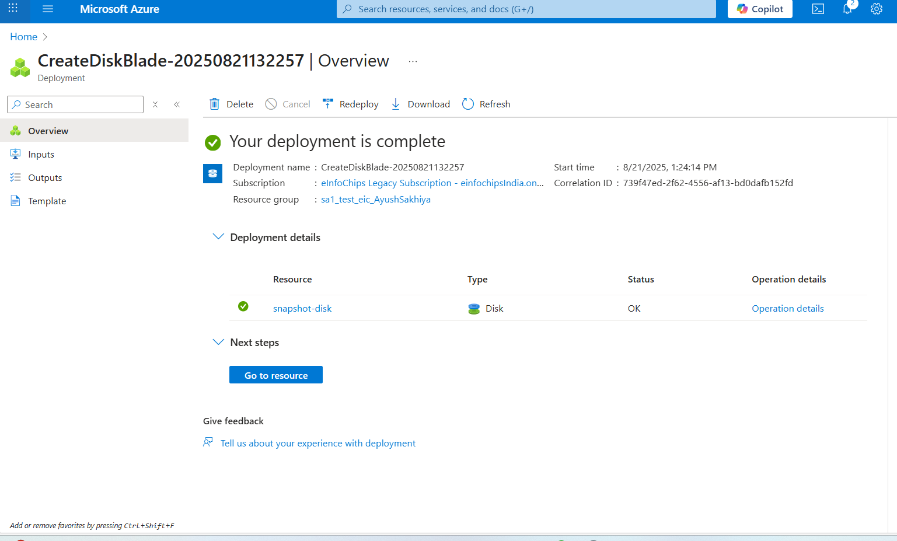
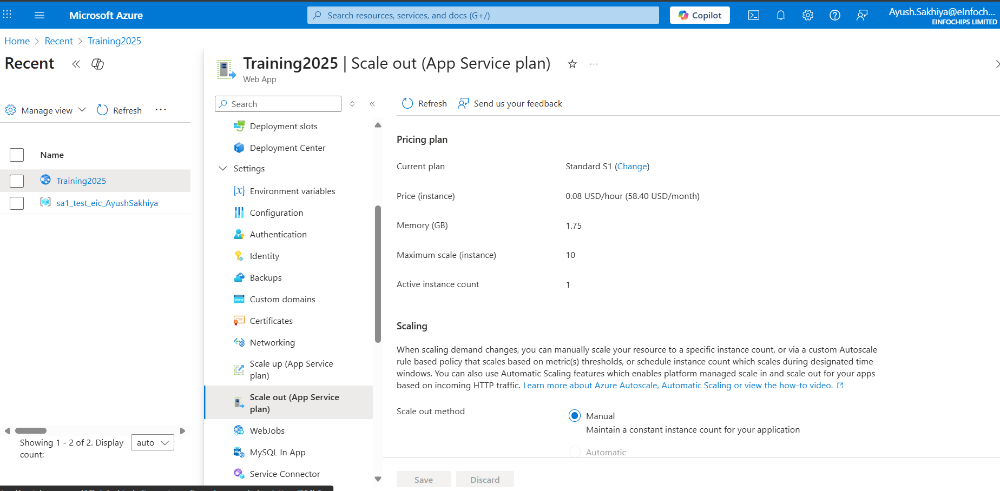
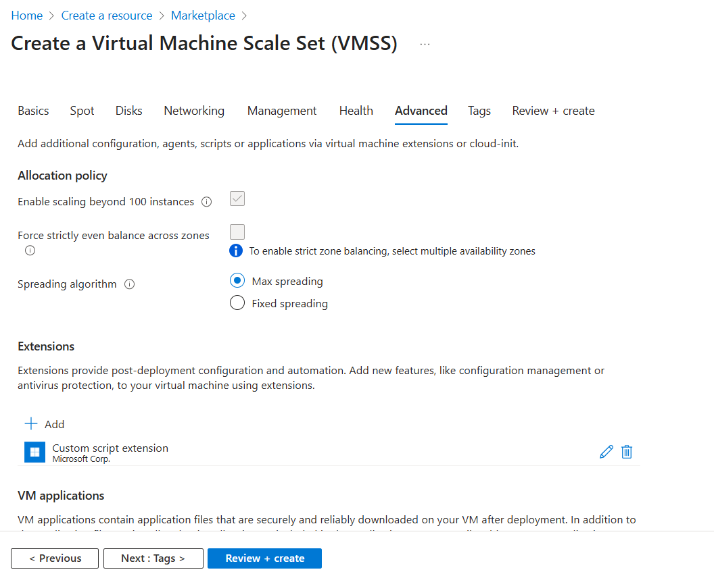
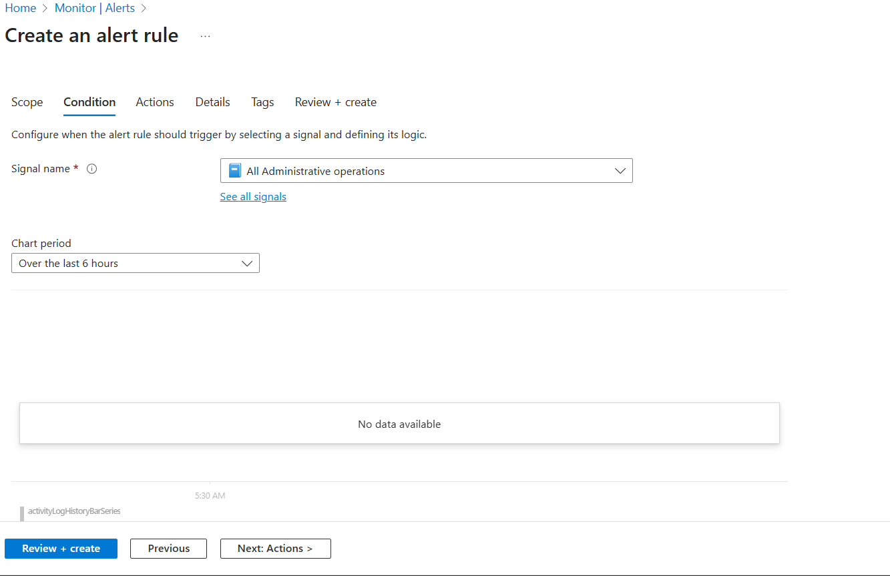

# Deploy and Manage Azure cpmpute resources

### Bulding a Virtual machine

- resource group is a logical grouping of Resources

- Azure regions - An Azure region is a geographical area that contains one or more data centers. It's the location where you deploy and run your cloud services, like virtual machines and web apps.

#### Deploying a linux and windows virtual machine

### Azure VM Size Categories
- General Purpose (A, B, D series):These offer a balanced CPU-to-memory ratio and are perfect for a wide range of common tasks. This includes development and testing environments, web servers, and small-to-medium databases.

- Compute Optimized (F series): These VMs have a high CPU-to-memory ratio, making them ideal for applications that are CPU-intensive. Use them for workloads like batch processing, high-traffic web servers, and application servers.

- Memory Optimized (E, M series): These are designed for memory-intensive workloads, such as large relational databases, in-memory analytics, and data warehousing.

- Storage Optimized (L series):These VMs are built for high disk throughput and I/O. They are great for NoSQL databases, data warehousing, and other applications that require fast access to large amounts of data.

- GPU Optimized (N series): These VMs include specialized hardware (NVIDIA GPUs) for computationally demanding tasks like machine learning, deep learning, and heavy graphics rendering.

- High-Performance Computing (H series):These are the most powerful VMs, designed for high-performance computing (HPC) workloads. They feature premium CPUs, fast networking, and are suitable for tasks like scientific simulations and financial analysis.

### Azure Virtual Machine – Disks

- these are block-level storage volumes that are managed by Azure

- Throughput - if we need to cpoy large videos, then a higher throughput is required on the disk

- IOPS - if the machine is hosting a databse manay read and write operations occur per second on the database for this we need to higher IOPS (input/output operations per second)

#### adding data disk

- Disk snapshot - you can  create a read-only copy of a hard disk via the use of snapshot this can be used as a point-in-time backup you can create a backup of the os and data disk.

- you can also create a new disk from the the snapshot

 - created a snapshot of disk

 

 - now using above snapshot creating a disk

 

- attached to VM

### Azure Key Vault

- Azure Key Vault is a cloud service that provides a secure, centralized location for storing and managing sensitive information like cryptographic keys, secrets, and certificates.

- Days to retain - 
It can be configured to between 7 to 90 days. Once it has been set, it cannot be changed or removed.

#### created Azure Key Vault

 - Disk Encryption Set (DES) can be used to encrypt both OS and data disks. A DES is a resource used to manage customer-managed keys (CMKs) for Azure managed disks.

 ### custom script extensions

- The Custom Script Extension is an Azure VM extension that allows you to download and execute scripts on your virtual machines. This is a powerful tool for post-deployment configuration and automation tasks, as it saves you from having to manually log into each VM to perform the same actions.

- Custom Script Extension (CSE): You can run it during VM creation or later, on an already running VM.
- Works on both Windows and Linux VMs. It uses PowerShell on Windows and Bash on Linux.

- cloud-init: By default, cloud-init scripts run only once on the first boot of the VM.
- Primarily used for Linux VMs. While it can be used for Windows in some limited scenarios

for impliment custom script extensions need to create storage account to custom scrit 

upload  script file into containers
containers =  this is like top level folder for holding objects

### Availability Sets
- An Availability Set is a logical grouping of virtual machines (VMs) in Azure that helps ensure your application remains available during planned maintenance or unplanned hardware failures. It's a foundational concept for building resilient applications.

- fault domains (separate racks) and update domains (groups for planned maintenance).

- Fault Domains: These are physical racks of servers in an Azure data center that share a common power source and network switch. When you put VMs in an Availability Set, Azure automatically distributes them across multiple fault domains. This way, if a power outage or network failure affects one rack, only a subset of your VMs will be impacted, and the rest will remain online. By default, Azure uses up to three fault domains per Availability Set.

- Update Domains: These are logical groups of VMs that can be updated and rebooted together during planned Azure maintenance. By distributing your VMs across different update domains, Azure ensures that only one group is taken offline for updates at a time. This staggered process prevents your entire application from going down simultaneously, allowing for continuous availability

### Availability zones

- An availability zone is a group of data centers.

###  scale sets 

- An Azure Virtual Machine Scale Set is allows you to manage and automatically scale a group of identical virtual machines. It simplifies the deployment and management of a large number of VMs by allowing you to treat them as a single resource.

- Uniform Orchestration = 
This is the traditional and original orchestration mode. It treats all VMs in the scale set as a single, identical group.manage by scale se

- Flexible Orchestration = 
This is a newer, more modern orchestration mode that gives you greater control and flexibility.Now what we can deploy a new Azure VM and make it as part of the scale set

- created Virtual machine scale set

- cool down = The amount of time to wait after a scale operation before scaling again. For example, if cooldown is 10 minutes and a scale operation just occurred, Autoscale will not attempt to scale again until after 10 minutes. This is to allow the metrics to stabilize first.

- Scale based on a metric 

### virtual machine images
 1. specialized image - A specialized image is essentially a snapshot or exact replica of an existing VM.

- Contains Unique Data: It includes all machine-specific information from the original VM, such as the computer name, user accounts, SIDs (Security Identifiers), and network configuration.

 2. generalized image - A generalized image is a VM template that has been prepared to be used for creating many new VMs (e.g., for scale sets).

 - Unique Data Removed: Before the image is created, a process called Sysprep for Windows or waagent -deprovision for Linux runs to remove all unique, machine-specific information. This "depersonalizes" the 
 
 ### Proximity Placement Groups

 - it's a way to ensure that your VMs are physically located as close to each other as possible, within the same data center.

 - Create proximity placement group
 

 

 

 ### Azure Web Apps
- Azure App Service, is a Platform as a Service (PaaS) that provides a fully managed environment for hosting web applications.

 - In simple terms, it's a way to deploy your website or web application to the cloud without having to worry about managing the underlying infrastructure like virtual machines, operating systems, or web servers. You just focus on your code, and Azure handles everything else.

 - Language Support: It supports a wide variety of programming languages and frameworks, including .NET, Java, Node.js, Python, and PHP.

 
 

### Deployment Slots

- Deployment Slots are live versions of your web app that run on different URLs. They allow you to deploy and test a new version of your application in a safe environment before making it available to your users.

-  Instead of deploying your new code directly to the production slot, you deploy it to the staging slot. This new version is live but hidden from your users. You can then test it, run automated tests, and ensure everything is working correctly without affecting your live website.

- Once you are confident that the new version is stable, you perform a "swap" operation. Azure instantly and seamlessly swaps the contents of the staging slot with the production slot. The URL that was pointing to the old, live app now points to the new version, and the old version is moved to the staging slot.

- Autoscaling for Web Apps

### Azure Container Registry (ACR) 

- ACR is a managed, private Docker registry service in Azure. It is a secure place to store and manage your container images and other related artifacts.

### Azure Container Group 

- Azure Container Group is a collection of containers that are deployed and managed together on a single host machine. Think of it as a logical grouping of one or more containers that share resources like a network, storage, and a lifecycle.

# Configure and manage virtual networking

### Virtual Networks 

-  Virtual Networks is private and isolated network in the Azure cloud. It provides a secure environment Azure resources—like virtual machines, web apps, and databases—to communicate with each other, the internet, and on-premises network.

### Subnets

- logical subdivision of a larger network. The process of dividing a network into subnets is called subnetting.
- The main use of subnets is to improve network performance, security, and management. By dividing a large network into smaller ones

- Public Subnet: A subnet that has a direct route to the internet, typically through an Internet Gateway. Resources in a public subnet, such as web servers and load balancers, are accessible from the public internet.

- Private Subnet: A subnet that has no direct route to the internet. These are highly secure and used to host internal resources like databases, application servers, and other sensitive data that should not be exposed to the public internet

### network interface

- network interface is a component that enables a computer to connect to a network. It can be a physical piece of hardware, like a network card (also known as a NIC), or a virtual component used in cloud computing.

- In Azure, a Network Interface (NIC) is a virtual network card that allows a virtual machine (VM) to communicate with other resources in an Azure Virtual Network (VNet), the internet, and on-premises networks.

- if we want to attach the new  interface ontoVM machine, It needs to be in the same virtual network and it needs to be in the same subnet.

### Network Security Groups

- Network Security Group (NSG) is a security feature in Azure that acts as a virtual firewall for your virtual network. It contains a set of security rules that allow or deny inbound and outbound network traffic to your Azure resources

#### Network Security Groups - Priority setting

- if we set lower priority for rules So that was evaluated first .

- ping request uses ICMP protocol

- NSG acts as a virtual firewall that filters network traffic. Its stateful nature means incoming request is allowed,the outgoing response is automatically allowed as well.

- When NSG rules are assigned at both the subnet and network interface (NIC) levels, Azure evaluates traffic differently depending on the direction of the flow. In both cases, for traffic to be allowed, it must be permitted by both the NSG on the subnet and the NSG on the NIC. If either NSG denies the traffic, it is blocked.

- Inbound Traffic

  - For traffic coming into a virtual machine:

  - Subnet NSG is evaluated first. Azure processes the rules of the NSG associated with the subnet. The rules are evaluated in order of priority (lowest number first).

  - NIC NSG is evaluated second. If the subnet NSG allows the traffic, it then proceeds to the NSG associated with the virtual machine's NIC.

  - Final Decision. Both NSGs must have an "Allow" rule that matches the traffic for it to reach the virtual machine. If the subnet NSG denies the traffic, the NIC NSG is never even checked.

- outbound Traffic

  - For traffic leaving a virtual machine:

  - NSG is evaluated first. Azure processes the rules of the NSG associated with the virtual machine's NIC.

  - Subnet NSG is evaluated second. If the NIC NSG allows the traffic, it then proceeds to the NSG associated with the subnet.

  - Final Decision. Both NSGs must have an "Allow" rule that matches the traffic for it to leave the virtual network. If the NIC NSG denies the traffic, it is blocked before it even reaches the subnet NSG.

### Application Security Group (ASG) :
    
- Application Security Group (ASG) is a logical tag in Azure that lets you group virtual machines by their application role, so you can write and manage firewall rules without referencing specific IP addresses.

### Azure Bastion :

- Azure Bastion is a fully managed service that provides more secure Remote Desktop Protocol (RDP) and Secure Shell Protocol (SSH) access to virtual machines (VMs)

  - first create a new subnet in vnet subnet name mustbe AzureBastionSubnet
   
   

  - now go to the bastion and deploy bastion service

    
  - dissociate the publice ip from the VM beacuse make sure that there is no way to connect to this machine using publice ip.

   
  

  - now coonect to vm using  bastion
  
  

### Virtual Network Peering :

- VNet peering is a networking service that connects two or more Azure Virtual Networks (VNets), enabling them to communicate with each other as if they were a single network.

  - created two VM in different VNets
     

   - now open one of the Vnet and create peering
    
    
    
    
   - as i am able to loging using bastion in Training2 VM as  i have enabled bation in first vnet and Training2 VM is running in second subnet

    

### User Defined Routes
- User-Defined Routes (UDRs) are a networking feature in Azure that allows you to control the flow of traffic within and from a virtual network (VNet). By default, Azure automatically manages routing for you, but UDRs give you the ability to override these default routes to direct traffic to specific destinations.

  

### Network Watcher services

- Connection Monitor : Check the network connectivity between machines. These can be in Azure or on your on-premises environments
  - This can check TCP and ICMP connections from Azure virtual machines, machine scale sets, bastion instances and Application Gateways.
  - Destinations supported - Virtual Machines, Fully qualified domain names, URI's or IP addresses.
  - Detect issues that impact connectivity that include Virtual machine firewall rules at the OS level, NSG's that are blocking traffic, High VM CPU or Memory utilization.

- Next hop : Here you can see the next route for a packet of data. This helps you understand whether the packet is being 
routed to the correct destination

- IP Flow Verify : This can be used to check if a packet is allowed or denied to or from a virtual machine. If a packet is being denied by a security group, you can see which rule is denying the packet

- Connection troubleshoot : Check the connection from a virtual machine to a virtual machine, fully qualified domain name, URI or IPv4 address.

- NSG Diagnostic : Provides detailed information that helps to 
understand and debug the security configuration of the network

- Traffic Analytics : This helps to log information 
about the IP traffic that is flowing through an NSG.

- NSG Flow Logs : Helps to provide visibility into 
user and application activity in cloud networks.

### Azure Load Balancer Service : 

- Azure Load Balancer is a service that automatically distributes incoming network traffic across multiple backend resources.

- health probe  : is a feature of a load balancer that monitors the health and availability of the backend instances (like VMs) in its pool. It works by periodically sending a request to a specified port and path on each instance to check if it's responsive.

 #### Azure Load Balancer - Standard 

 - created two vm 1. LBVM1 and 2. LBVM 2 with Custom script extension

- created standard LB amd add backend pool as a VM and Add health probe
  
  
  

- now add inbound NAT rule to loging into the vm when vm doesnot have publice ip 

- session persistence :  connections from the same client go to the same backend instance within the backend pool.

#### Standard Load Balancer - VM Scale Set

- created scale set with custom script extension and Upgrade mode
 set as automatic This will ensure that the custom Script extensions is enabled and then installed on the virtual machines
that be part of the Virtual Machine scale set.

- then atteched this scale set to LB as bakend pool

#### Azure application Gateway

- here routing is happened at the network level.this routing is faster because it just forwords the request to the desired bakend pool.

- The application gateway resource will need an empty subnet within a virtual network , gateway will use this dedicated subnet for deploying its own resources.

- Standard Load Balancer - Based on IP address and port
- Application Gateway - Based on URL path and host header

### DNS :
- DNS stands for Domain Name System. It's the internet's phonebook. Its main job is to translate human-friendly domain names (like www.google.com) into computer-readable numerical IP addresses (like 172.217.16.142)

### Azure Web App - Virtual Network Integration :

- this allows the azure web app to access resources withing a virtual network

# Implement and manage storage

### Blob service
 - Blob storage is  storing unstructured data.

   - Multimedia: Images, videos, and audio files for web applications or streaming services.

   - Documents: PDFs, Word documents, and text files.

   - Data for Analytics: Raw data for big data analytics and machine learning.

   - Backups: Long-term backups and archives for disaster recovery.

   - created storage account : 

     

   - first created New container :
      

   - now upload  contents in container , Each file is stored as a binary object.
     

   -  if we need to give publice access of the blobe then we can chnage access level of blobe before this we need to enable Allow Blob anonymous access (setting>Configuration)
   

#### Azure Storage Explorer
- Azure Storage Explorer is a free, standalone desktop application that allows you to easily manage your Azure storage resources from your Windows, macOS, or Linux computer.
#### Shared Access Signature (SAS) - Blob Level

  

#### Shared Access Signatures(SAS) - Container Level
-  if we need to access SAS of container level in Azure Storage Explorer so wee need to give extra Permission as list

#### Shared Access Signatures (SAS) - At the Storage Account Level

#### Stored Access Policy
- Stored Access Policy in Azure is a server-side resource that provides an additional layer of control over Shared Access Signatures (SAS). It defines a set of permissions, a start time, and an expiry time that can be inherited by one or more service SAS tokens.

#### Azure Storage Accounts - Data Redundancy
- Azure Storage offers several data redundancy options to ensure the durability and availability of your data. These options vary in cost, performance, and the level of protection they provide against different types of failures. All Azure storage accounts, regardless of the option you choose, store at least three copies of your data in the primary region.

  - Redundancy within a single region

     - Locally Redundant Storage (LRS): 

       This is the lowest-cost option. LRS synchronously replicates your data three times within a single physical data center in the primary region. It protects against component failures like a drive or server rack failure but does not protect against a data center-wide disaster, such as a fire or flood.

    - Zone-Redundant Storage (ZRS): 
    
      ZRS is a more robust option. It synchronously replicates your data across three different Azure availability zones within the primary region. Each availability zone is a separate physical location with independent power, cooling, and networking. ZRS provides protection against a data center-level failure.

   - Redundancy across multiple regions :

      - Geo-Redundant Storage (GRS): 
      
        This option provides cross-regional redundancy. GRS replicates your data three times in the primary region (using LRS) and then asynchronously replicates another three copies to a single physical location in a secondary, geographically distant region. This protects against a full regional outage, but the secondary copy is not accessible for reads or writes unless a failover is initiated.

       - Geo-Zone-Redundant Storage (GZRS):
       
         GZRS combines the best of both worlds. It replicates your data synchronously across three availability zones in the primary region (using ZRS) and then asynchronously replicates three additional copies to a secondary region. This offers the highest level of durability and availability, protecting against both zonal and regional disasters.

#### Storage Accounts - Access Tiers

  - Hot : object that are accessed frequently

  - cool : object that are aceessed infrequently , object needs to be stored for a minimum of 30 days

      -  storage costs are lower compare to hot but the access cost are higher

  - cold : object that are aceessed rarely, object needs to be stored for a minimum of 90 days
  
 -  archive : object that are aceessed rarely, object needs to be stored for a minimum of 180 days
      - if we need to change tier from archive to hot,cool,cold then need to procees data with rehydrate proccess

#### Azure Storage Accounts - Lifecycle policies      
 - A lifecycle policy is a collection of rules that define what actions to take on your data. These rules are executed once a day at the storage account level.

#### File shares : file share > directory > file.

#### Azure Private Endpoint : 

- Azure Private Endpoint is a network interface that provides a private and secure connection between your Azure virtual network and an Azure Storage account. This connection uses a private IP address from your virtual network, effectively "bringing" the storage account into your private network.

- service endpoint :
  - is a network security feature in Azure that allows you to secure and control access to Azure PaaS (Platform as a Service) resources. It works by extending the identity of your virtual network to a specific Azure service, such as Azure Storage, Azure SQL Database, or Azure Key Vault.

# manage Azure identities and governance
 
  - Authentication : identity of the users are verified
  - authorization : permissions are checked for the users.

### Microsoft Entra ID
- tenant is dedicated, isolated instance of that Microsoft Entra ID
- formerly known as Azure Active Directory (Azure AD), is a cloud-based identity and access management (IAM) service. It is the central directory service used to manage user identities and control access to a wide range of applications and resources.

- Role based access Control

  - rules : a set of permissions.

  - we can assign a role at the subscription , resource group and resource leve;l

- Contributor Role : 

   - The Contributor role grants full access to manage all resources, but it does not allow a user to manage access or assign roles to others.
      - Permissions: Create, update, and delete all types of Azure resources.
      - Limitations: Cannot assign roles, manage access to resources, or elevate their own privileges.

- User Access Administrator Role : 

   - The User Access Administrator role, on the other hand, gives a user the ability to manage user access to Azure resources
     - Permissions: Assign or remove roles (like Contributor, Reader, etc.) to users, groups, and service principals.
     - Limitations: Cannot create, update, or delete any Azure resources.

- Data actions :  Data actions is what you can perform on data within a resource. 

- Locking resources   : is an Azure feature that prevents an Azure subscription, resource group, or individual resource from being accidentally deleted or modified. It's an important layer of protection that overrides any user permissions. Even an administrator with the highest-level permissions, like an Owner, cannot perform a blocked operation until the lock is removed.

- if we move resource from one RG to another RG then

   - if desination RG hase no Read only locke then we can move

   

  - 1. Source RG has a `ReadOnly` lock, and the destination has no lock
 **Cannot move.** The `ReadOnly` lock on the source RG prevents the deletion of the resource from the source, which is a required step for a move operation.

  - 2. Source RG has a `CanNotDelete` lock, and the destination has no lock
 **Cannot move.** The `CanNotDelete` lock on the source RG explicitly prevents the resource from being deleted, which is required for the move.

  - 3. Source RG has no lock, and the destination has a `ReadOnly` lock
**Cannot move.** The `ReadOnly` lock on the destination RG prevents any new resources from being created or written to it. The move operation includes a write action on the destination, so the lock will block it.

  - 4. Source RG has no lock, and the destination has a `CanNotDelete` lock
**Can move.** The `CanNotDelete` lock on the destination RG only prevents deletion. It does not prevent a resource from being created or moved into the resource group. Once the resource is in the destination RG, it will be protected by the lock.

  - 5. Source RG has a `CanNotDelete` lock, and the destination has a `ReadOnly` lock
**Cannot move.** This is a combination of the first two scenarios. The `CanNotDelete` lock on the source prevents deletion, and the `ReadOnly` lock on the destination prevents writing. The move operation fails on both counts.

- Azure Advisor  : is a personalized cloud consultant that helps you follow best practices to optimize your Azure deployments. It analyzes your resource usage and configurations and then provides proactive, actionable, and personalized recommendations to help you improve the security, performance, high availability, and cost-effectiveness of your Azure resources.

- Azure policy : helps to govern your resources
   - for examoke company only wants VM to be constrained to a particular region or need to be certain sku 
   -  can appliy with subscription>resource group

- management groups : this helps to manage different subscriptions

# Monitor and back up Azure resources 

### Azure Monitor Service :

-  Azure Monitor is a unified monitoring service that provides a comprehensive view of your Azure resources, applications, and infrastructure. It helps you collect, analyze, and act on telemetry data from your cloud and on-premises environments to ensure high performance and availability.

- Azure Monitor - Alerts : 

   -  An action group is a set of actions that can be applied to an alert rule

   - Suppressing alerts : When an alert is suppressed, the alert rule continues to run and evaluate the conditions, but it does not send out notifications (e.g., emails, SMS, or webhooks) during the suppression period. This is typically configured for a specified duration, after which the suppression automatically ends and notifications resume.

   - created Alert based on resource 
   
   
   
   
   

-  Log Analytics Workspace : 

    - A Log Analytics workspace is a unique environment within Azure Monitor where you collect, aggregate, and analyze log data from various sources. It's the central repository for all your logs and telemetry.

    
    

-  DCR (Data collection rules) is a resource in Azure that you can associate with one or more VMs or other resources. The Azure Monitor Agent, installed on the VM, reads the DCR and performs the collection and transformation of the specified logs. The DCR also defines where the collected logs should be sent, such as a Log Analytics workspace or Azure Monitor Metrics
    - send some logs onto the Log Analytics workspace For this we need to create data collection rule.
    - the scope for the data collection rule, at this point in time, we can only select virtual machines as resources

 - Azure VM Insights  : is a feature of Azure Monitor that provides a comprehensive view of the performance, health, and dependencies of your Azure virtual machines (VMs). It's designed to streamline the monitoring process by automatically collecting key performance data from your VM's guest operating system and presenting it in a clear, organized way.

### Azure Backup feature :

- Azure Backup is a cost-effective, secure, and scalable cloud-based backup service

 - Azure Virtual Machine - Backup :
    - the backup for VM are stored in a recovery service vault.
    - for VM backup VM and recovery service vault to be in same region. 

 - Recovery Services vault : This is the traditional and more versatile vault. It can protect a wide range of workloads, including on-premises servers using the MARS agent, Azure VMs, SQL Server in Azure VMs, and Azure File shares. It is also the vault type required for using Azure Site Recovery for disaster recovery. It's designed for both short-term and long-term retention.

 - Backup vault: This is a newer, more streamlined vault designed for a specific set of modern, Azure-native workloads. It is primarily used to protect services like Azure Disks and Azure Database for PostgreSQL Servers. A Backup vault offers a simpler backup solution for these specific services and focuses on providing an operational backup without the broader feature set of a Recovery Services vault

- The Microsoft Azure Recovery Services (MARS) :  agent is a lightweight software agent used by Azure Backup to back up files, folders, and system state from Windows machines directly to a Recovery Services vault in Azure.

- Azure Site Recovery :  is a disaster recovery as a service (DRaaS) solution that helps you protect and replicate your applications and workloads to a secondary location, ensuring business continuity during outages. It automatically orchestrates the replication of virtual machines (VMs) and physical servers to either Azure or a secondary on-premises data center.

- create new resource group using powershell script

- create new virtual network

- creat new virtual network with subnet

- create new network interface with existing virtual network

- create new resource group using azure cloud cli
  
[command documentation](https://learn.microsoft.com/en-us/cli/azure/group?view=azure-cli-latest#code-try-1)

- create resource group 
  

- creat Vnet

 
- create VM

   

