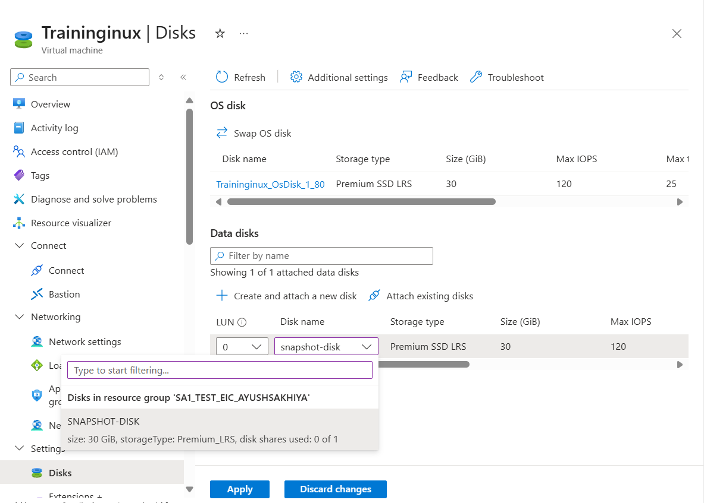
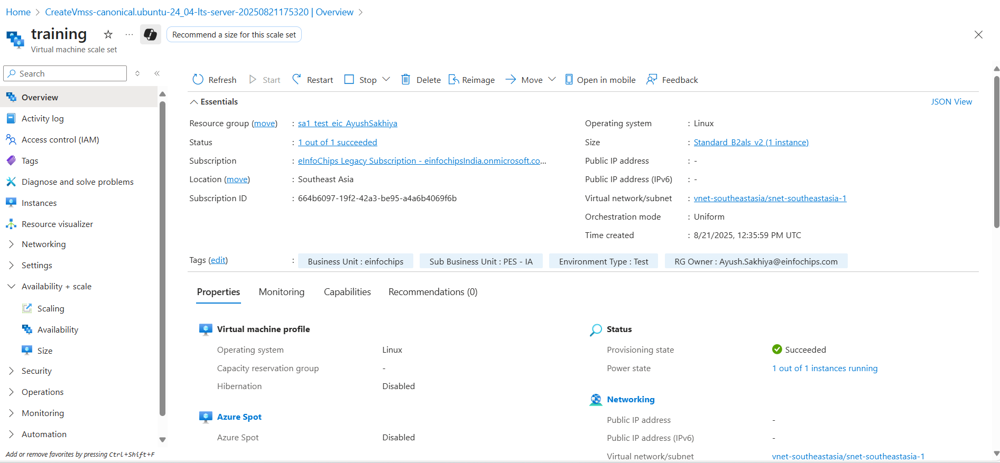

# Deploy and Manage Azure cpmpute resources

### Bulding a Virtual machine

- resource group is a logical grouping of Resources

- Azure regions - An Azure region is a geographical area that contains one or more data centers. It's the location where you deploy and run your cloud services, like virtual machines and web apps.

#### Deploying a linux and windows virtual machine

### Azure VM Size Categories
- General Purpose (A, B, D series):These offer a balanced CPU-to-memory ratio and are perfect for a wide range of common tasks. This includes development and testing environments, web servers, and small-to-medium databases.

- Compute Optimized (F series): These VMs have a high CPU-to-memory ratio, making them ideal for applications that are CPU-intensive. Use them for workloads like batch processing, high-traffic web servers, and application servers.

- Memory Optimized (E, M series): These are designed for memory-intensive workloads, such as large relational databases, in-memory analytics, and data warehousing.

- Storage Optimized (L series):These VMs are built for high disk throughput and I/O. They are great for NoSQL databases, data warehousing, and other applications that require fast access to large amounts of data.

- GPU Optimized (N series): These VMs include specialized hardware (NVIDIA GPUs) for computationally demanding tasks like machine learning, deep learning, and heavy graphics rendering.

- High-Performance Computing (H series):These are the most powerful VMs, designed for high-performance computing (HPC) workloads. They feature premium CPUs, fast networking, and are suitable for tasks like scientific simulations and financial analysis.

### Azure Virtual Machine – Disks

- these are block-level storage volumes that are managed by Azure

- Throughput - if we need to cpoy large videos, then a higher throughput is required on the disk

- IOPS - if the machine is hosting a databse manay read and write operations occur per second on the database for this we need to higher IOPS (input/output operations per second)

#### adding data disk

- Disk snapshot - ypu can  create a read-only copy of a hard disk via the use of snapshot this can be used as a point-in-time backup you can create a backup of the os and data disk.

- you can also create a new disk from the the snapshot

 - created a snapshot of disk

 

 - now using above snapshot creating a disk

 

- attached to VM

### Azure Key Vault

- Azure Key Vault is a cloud service that provides a secure, centralized location for storing and managing sensitive information like cryptographic keys, secrets, and certificates.

- Days to retain - 
It can be configured to between 7 to 90 days. Once it has been set, it cannot be changed or removed.

#### created Azure Key Vault

 - Disk Encryption Set (DES) can be used to encrypt both OS and data disks. A DES is a resource used to manage customer-managed keys (CMKs) for Azure managed disks.

 ### custom script extensions

- The Custom Script Extension is an Azure VM extension that allows you to download and execute scripts on your virtual machines. This is a powerful tool for post-deployment configuration and automation tasks, as it saves you from having to manually log into each VM to perform the same actions.

- Custom Script Extension (CSE): You can run it during VM creation or later, on an already running VM.
- Works on both Windows and Linux VMs. It uses PowerShell on Windows and Bash on Linux.

- cloud-init: By default, cloud-init scripts run only once on the first boot of the VM.
- Primarily used for Linux VMs. While it can be used for Windows in some limited scenarios

for impliment custom script extensions need to create storage account to custom scrit 

upload  script file into containers
containers =  this is like top level folder for holding objects

### Availability Sets
- An Availability Set is a logical grouping of virtual machines (VMs) in Azure that helps ensure your application remains available during planned maintenance or unplanned hardware failures. It's a foundational concept for building resilient applications.

- fault domains (separate racks) and update domains (groups for planned maintenance).

- Fault Domains: These are physical racks of servers in an Azure data center that share a common power source and network switch. When you put VMs in an Availability Set, Azure automatically distributes them across multiple fault domains. This way, if a power outage or network failure affects one rack, only a subset of your VMs will be impacted, and the rest will remain online. By default, Azure uses up to three fault domains per Availability Set.

- Update Domains: These are logical groups of VMs that can be updated and rebooted together during planned Azure maintenance. By distributing your VMs across different update domains, Azure ensures that only one group is taken offline for updates at a time. This staggered process prevents your entire application from going down simultaneously, allowing for continuous availability

### Availability zones

- An availability zone is a group of data centers.

###  scale sets 

- An Azure Virtual Machine Scale Set is a tool that allows you to manage and automatically scale a group of identical virtual machines. It simplifies the deployment and management of a large number of VMs by allowing you to treat them as a single resource.

- Uniform Orchestration = 
This is the traditional and original orchestration mode. It treats all VMs in the scale set as a single, identical group.manage by scale se

- Flexible Orchestration = 
This is a newer, more modern orchestration mode that gives you greater control and flexibility.Now what we can deploy a new Azure VM and make it as part of the scale set

- created Virtual machine scale set

- cool down = The amount of time to wait after a scale operation before scaling again. For example, if cooldown is 10 minutes and a scale operation just occurred, Autoscale will not attempt to scale again until after 10 minutes. This is to allow the metrics to stabilize first.

- Scale based on a metric 

### virtual machine images
 1. specialized image - A specialized image is essentially a snapshot or exact replica of an existing VM.

- Contains Unique Data: It includes all machine-specific information from the original VM, such as the computer name, user accounts, SIDs (Security Identifiers), and network configuration.

 2. generalized image - A generalized image is a VM template that has been prepared to be used for creating many new VMs (e.g., for scale sets).

 - Unique Data Removed: Before the image is created, a process called Sysprep for Windows or waagent -deprovision for Linux runs to remove all unique, machine-specific information. This "depersonalizes" the 
 
 ### Proximity Placement Groups

 - it's a way to ensure that your VMs are physically located as close to each other as possible, within the same data center.

 - Create proximity placement group
 

 

 

 ### Azure Web Apps
- Azure App Service, is a Platform as a Service (PaaS) that provides a fully managed environment for hosting web applications.

 - In simple terms, it's a way to deploy your website or web application to the cloud without having to worry about managing the underlying infrastructure like virtual machines, operating systems, or web servers. You just focus on your code, and Azure handles everything else.

 - Language Support: It supports a wide variety of programming languages and frameworks, including .NET, Java, Node.js, Python, and PHP.

 
 

### Deployment Slots

- Deployment Slots are live versions of your web app that run on different URLs. They allow you to deploy and test a new version of your application in a safe environment before making it available to your users.

-  Instead of deploying your new code directly to the production slot, you deploy it to the staging slot. This new version is live but hidden from your users. You can then test it, run automated tests, and ensure everything is working correctly without affecting your live website.

- Once you are confident that the new version is stable, you perform a "swap" operation. Azure instantly and seamlessly swaps the contents of the staging slot with the production slot. The URL that was pointing to the old, live app now points to the new version, and the old version is moved to the staging slot.

- Autoscaling for Web Apps

### Azure Container Registry (ACR) 

- ACR is a managed, private Docker registry service in Azure. It is a secure place to store and manage your container images and other related artifacts.

### Azure Container Group 

- Azure Container Group is a collection of containers that are deployed and managed together on a single host machine. Think of it as a logical grouping of one or more containers that share resources like a network, storage, and a lifecycle.

# Configure and manage virtual networking

### Virtual Networks 

-  Virtual Networks is private and isolated network in the Azure cloud. It provides a secure environment Azure resources—like virtual machines, web apps, and databases—to communicate with each other, the internet, and on-premises network.

### Subnets

- logical subdivision of a larger network. The process of dividing a network into subnets is called subnetting.
- The main use of subnets is to improve network performance, security, and management. By dividing a large network into smaller ones

- Public Subnet: A subnet that has a direct route to the internet, typically through an Internet Gateway. Resources in a public subnet, such as web servers and load balancers, are accessible from the public internet.

- Private Subnet: A subnet that has no direct route to the internet. These are highly secure and used to host internal resources like databases, application servers, and other sensitive data that should not be exposed to the public internet

### network interface

- network interface is a component that enables a computer to connect to a network. It can be a physical piece of hardware, like a network card (also known as a NIC), or a virtual component used in cloud computing.

- In Azure, a Network Interface (NIC) is a virtual network card that allows a virtual machine (VM) to communicate with other resources in an Azure Virtual Network (VNet), the internet, and on-premises networks.

- if we want to attach the new  interface ontoVM machine, It needs to be in the same virtual network and it needs to be in the same subnet.

### Network Security Groups

- Network Security Group (NSG) is a security feature in Azure that acts as a virtual firewall for your virtual network. It contains a set of security rules that allow or deny inbound and outbound network traffic to your Azure resources

#### Network Security Groups - Priority setting

- if we setlower priority for rules So that was evaluated first .

